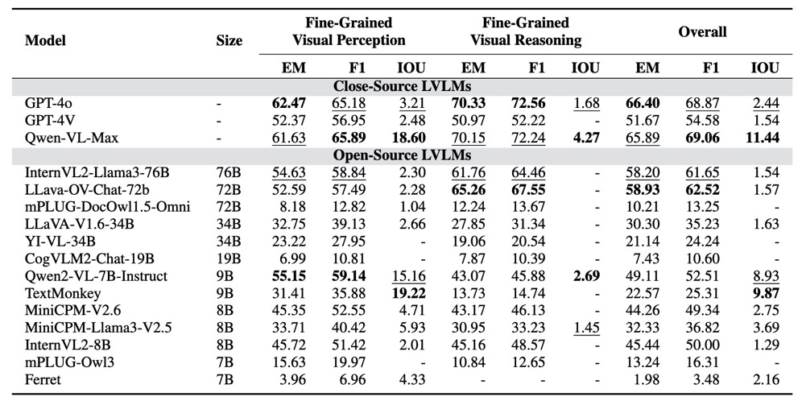

MMDocBench: Benchmarking Large Vision-Language Models for Fine-Grained Visual Document Understanding
=======

[[Project Page](https://mmdocbench.github.io/)] [[Paper](https://arxiv.org/abs/2410.21311)] [[Huggingface Dataset](https://huggingface.co/datasets/next-tat/MMDocBench)] [[Leaderboard](https://mmdocbench.github.io/#leaderboard)]

**MMDocBench** is an open-sourced benchmark with various OCR-free document understanding tasks for evaluating fine-grained visual perception and reasoning abilities.

This repository contains the evaluation code and instructions for the paper MMDocBench: Benchmarking Large Vision-Language Models for Fine-Grained Visual Document Understanding

For more details, please refer to the project page: https://MMDocBench.github.io/.


<p align="center">
     <br>

  **MMDocBench** consists of **15** main tasks and **48** sub-tasks, involving **2,400** document images, **4,338** QA pairs and **11,353** supporting regions (i.e., bounding boxes). Each QA pair corresponds to one or more supporting regions, marked with red dotted-line rectangles on the image.
</p>

## News
**[2024.10.10]** Our paper, benchmark and project page are publicly available!

## Model Evaluation

### Setup
For a quick installation of the environment, please run the following script:

```bash
git clone https://github.com/fengbin/MMDocBench.git
cd MMDocBench
pip install -e .
```

For more information, please refer to the Quick Start from [**VLMEvalKit**](https://github.com/open-compass/VLMEvalKit/blob/main/docs/en/get_started/Quickstart.md#quickstart) to set up the environment and prepare the evaluation script.

The dataset can be downloaded from [here]().


### Supported Models
This repo supports the evaluation of the following models with our benchmark:

**Close-source Models**
- GPT-4o
- GPT-4V
- Qwen-VL-Max

**Open-source Models**
- InternVL2-Llama3-76B
- LLava-OV-Chat-72b
- mPLUG-DocOwl1.5-Omni
- LLaVA-V1.6-34B
- Yi-VL-34B
- CogVLM2-Chat-19B
- Qwen2-VL-7B-Instruct
- TextMonkey
- MiniCPM-V2.6
- MiniCPM-Llama3-V2.5
- InternVL2-8B
- mPLUG-Owl3
- Ferret

To ensure a smooth evaluation process, make sure to install the specific version of the Transformers library as specified in the [**repository**](https://github.com/open-compass/VLMEvalKit/tree/main#-datasets-models-and-evaluation-results) for the model you wish to evaluate.

Some models are not supported by VLMEvalKit during our benchmark development.

We employed the models and the associated Transformers version for the benchmark as follows:
- mPLUG-DocOwl1.5-Omni: transformers=4.33
- TextMonkey: transformers=4.33
- Ferret: transformers=4.40

###  Configuration
Model configuration file can be found at `MMDocBench/vlmeval/config.py`.

Model paths should be specified in the configuration file. Additionally, we set the model's `max_new_tokens` parameter to 4096 in the config file as there are some tasks in our benchmark that requires long model prediction output. For some models such as llava and mplug_owl3, where the generation configuration is fixed, we modify the model files to support the usage of the `max_new_tokens` parameter.

### Run the evaluation

To run evaluation with either `python` or `torchrun` as follows to evaluate one model with MMDocBench.

- python
```bash
LMUData=/PATH/TO/TSV/DATA/ python run.py --data MMDocBench --model /MODEL/PATH/ --mode all --work-dir /PATH/TO/WORK_DIR/ --verbose
```

- torchrun
```bash
LMUData=/PATH/TO/TSV/DATA/ torchrun --nproc-per-node=8 run.py --data MMDocBench --model /MODEL/PATH/ --mode all --work-dir /PATH/TO/WORK_DIR/ --verbose
```

###  Evaluate Your Model

Please refer to the [VLMEvalKit repository](https://github.com/open-compass/VLMEvalKit/blob/main/docs/en/advanced_guides/Development.md#implement-a-new-model) to add the new model you wish to evaluate with MMDocBench.

## Leaderboard

<p align="center">
     <br>
</p>

## Citation

```
@misc{zhu2024mmdocbenchbench
      title={MMDocBench: Benchmarking Large Vision-Language Models for Fine-Grained Visual Document Understanding}, 
      author={Fengbin Zhu and Ziyang Liu and Xiang Yao Ng and Haohui Wu and Wenjie Wang and Fuli Feng and Chao Wang and Huanbo Luan and Tat Seng Chua},
      year={2024},
      eprint={2410.21311},
      archivePrefix={arXiv},
      primaryClass={cs.CV},
      url={https://arxiv.org/abs/2410.21311}, 
}
```

## Licence
The benchmark is distributed under the [CC BY-SA 4.0](https://creativecommons.org/licenses/by-sa/4.0/deed.en) license and the code is licensed under [Apache 2.0](https://github.com/open-compass/VLMEvalKit/blob/main/LICENSE) license following VLMEvalKit.
